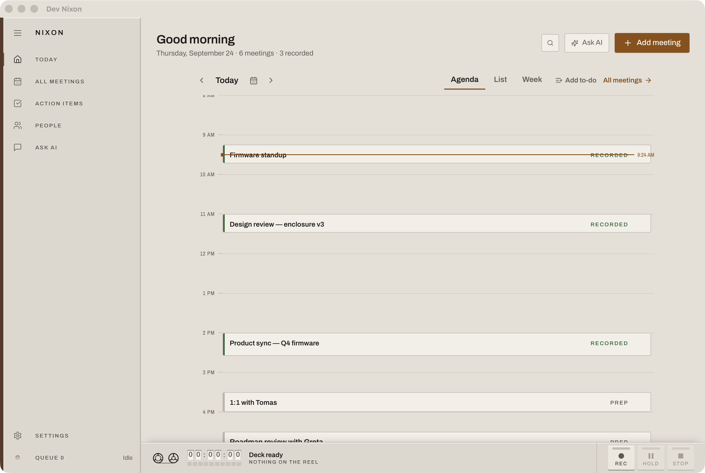
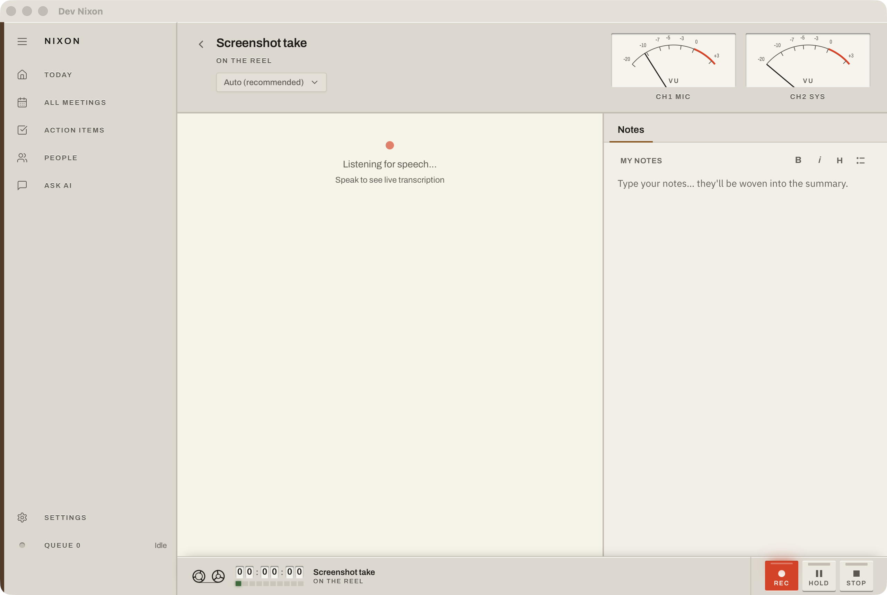
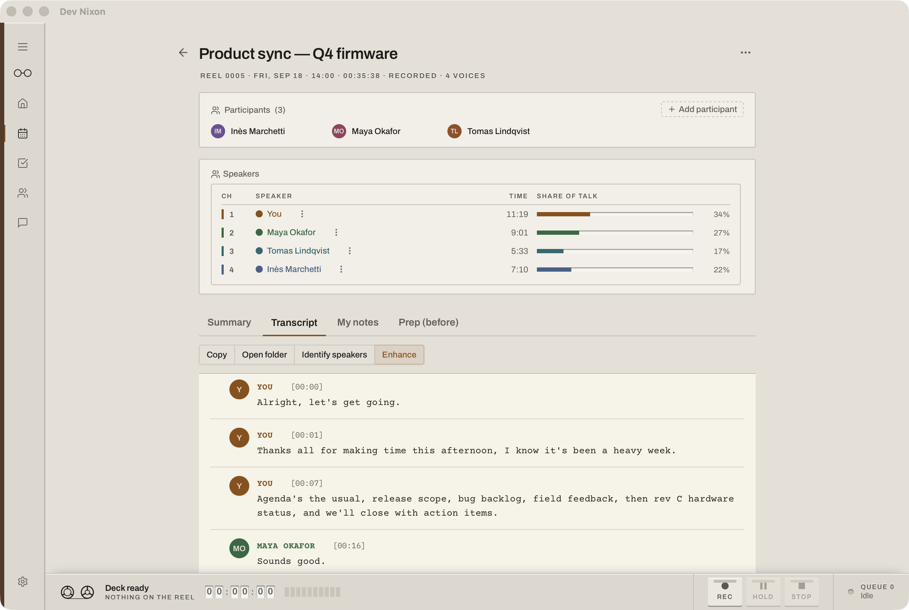
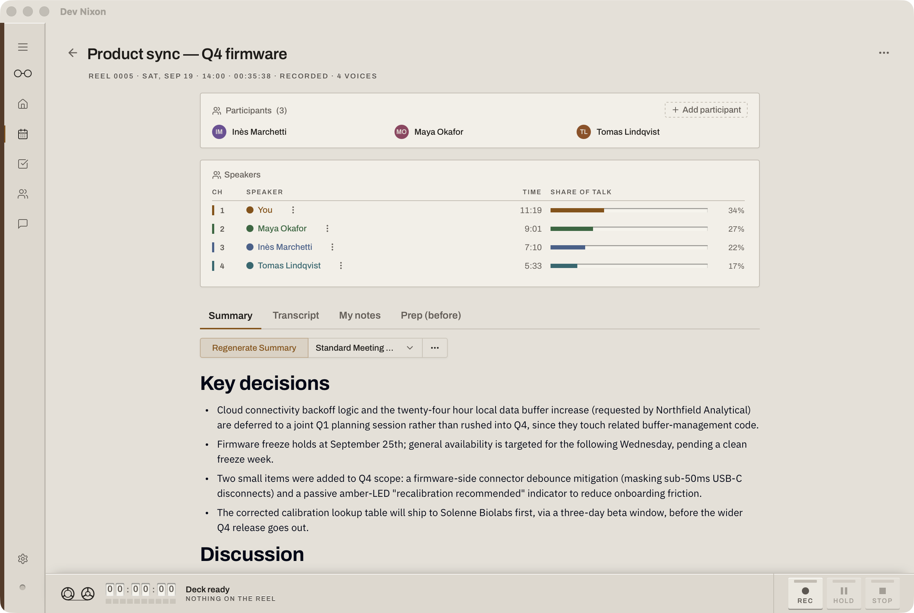
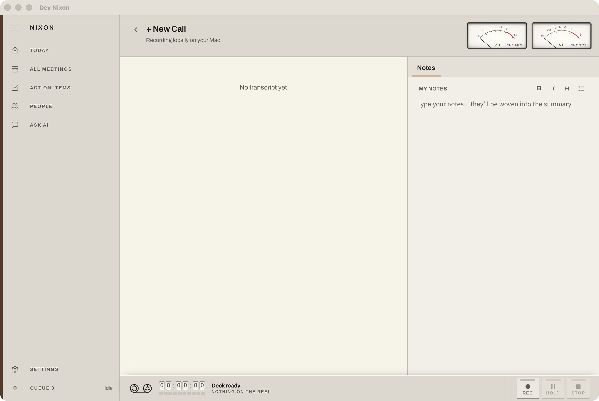
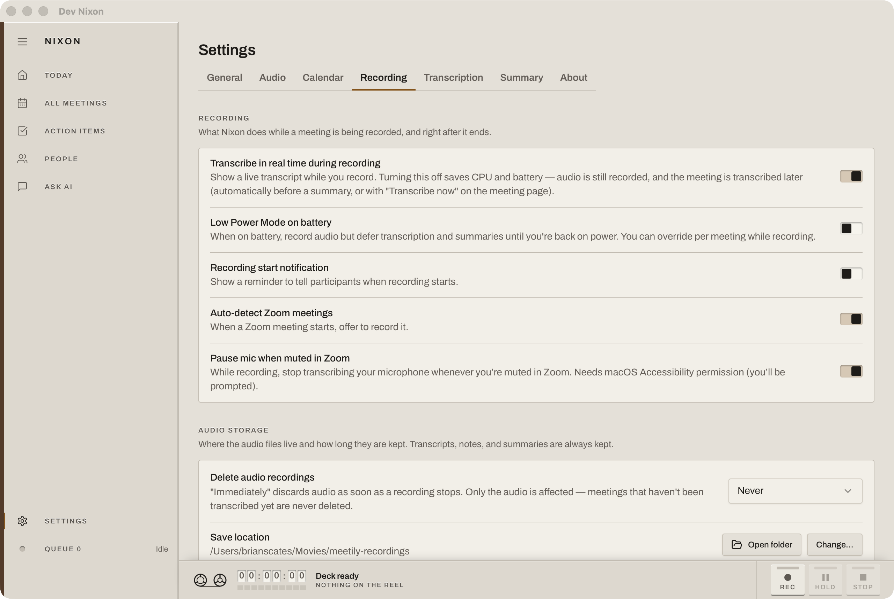

# Nixon

**Nixon is a local-first, on-device meeting assistant for macOS.** It records your
meetings (system audio + mic — Zoom / Meet / Teams), transcribes them in real time,
summarizes them, and organizes them for later reference.

Privacy is the whole point: meeting audio, transcripts, and notes never leave your
machine. The only outbound traffic is to a **you-chosen** LLM provider for
summarization — and the default is a local model via Ollama, so everything can stay
on-device. Nixon also checks GitHub for new versions in the background (no personal
data is sent); this can be turned off in Settings.

> Nixon is a hard fork of [meetily](https://github.com/Zackriya-Solutions/meeting-minutes)
> v0.4.0 (MIT) and diverges substantially. See [`CHANGELOG.md`](CHANGELOG.md) for the
> post-fork history.

## Screenshots

| Today | Recording |
|---|---|
|  |  |

| Transcript with speakers | Summary |
|---|---|
|  |  |

| Ask AI | Settings |
|---|---|
|  |  |

Deck (dark) variants live in [`docs/screenshots/real`](docs/screenshots/real). Every image is rendered from the fictional demo dataset (`./dev-nixon.sh --demo`).

*Images are regenerated with `pnpm shots:real` from a terminal that has Screen Recording permission; see [`docs/screenshots/README.md`](docs/screenshots/README.md).*

## Features

- **On-device transcription** — Whisper.cpp or NVIDIA Parakeet, real-time, with
  Metal / CoreML acceleration on Apple Silicon.
- **Notes-aware AI summaries** — a live notepad beside the transcript; your notes
  ground the summary so it captures what *you* thought mattered. Runs on local
  Ollama by default, or Anthropic Claude / OpenAI / Groq / OpenRouter / any
  OpenAI-compatible endpoint.
- **Speaker diarization** — label who said what, fully on-device; rename or merge
  speakers and seed names from your calendar's attendee list.
- **Calendar + Zoom** — reads your macOS Calendar to show your whole day's agenda,
  with one-click **Join & Record**.
- **Search & organization** — a meeting dashboard with full-text search.

## Requirements

- **macOS 14.4 or later on Apple Silicon.** Metal does the transcription and
  summarization work; 14.4 is where the Core Audio process tap lands, which is what
  captures system / Zoom audio without BlackHole.
- **Microphone** and **audio-capture** permission.
- **8 GB RAM minimum, 16 GB recommended.** Everything runs on this machine, so memory is
  the real constraint. At 16 GB or more Nixon summarizes with a 4B model (~3.9 GB while it
  works); below that it picks a 2B model (~1.8 GB) automatically. You never choose. On 8 GB
  the thing to watch is not Nixon alone but Nixon *plus* your video-call app.
- **Speed is not the constraint on older hardware.** Summarizing an hour-long meeting takes
  seconds on an M-series Max or Ultra and around a minute on a base M1 — the on-device model
  reads the transcript far faster than the meeting took. Transcription keeps up with live
  audio on every Apple Silicon generation.
- **~3 GB free disk** for the models it downloads on first use (speech recognition ~0.6 GB,
  speaker identification ~0.1 GB, summarization 1.3–2.6 GB depending on your RAM), plus
  **~250 MB per hour** of meetings you record. Recorded audio can be set to auto-delete
  after a number of days in Settings → Recordings.

## Build & run (macOS / Metal)

```bash
cd frontend
pnpm install
./dev-nixon.sh      # dev build ("Dev Nixon"), isolated from production data
./build-gpu.sh      # production build → ../target/release/bundle (.app + .dmg)
./upgrade-nixon.sh  # rebuild + reinstall /Applications/Nixon.app, preserving data
```

See [`CLAUDE.md`](CLAUDE.md) for the full architecture map and build notes.

## Privacy

Meeting audio, transcripts, and notes are stored locally and never transmitted.
The only outbound traffic is to your chosen LLM provider for summarization; use the
default local Ollama to keep everything on-device. Nixon also checks GitHub for new
versions in the background (no personal data is sent); this can be turned off in
Settings. See [`PRIVACY_POLICY.md`](PRIVACY_POLICY.md).

## Contributing

See [`CONTRIBUTING.md`](CONTRIBUTING.md).

## License

MIT — see [`LICENSE.md`](LICENSE.md). Nixon is a fork of meetily (also MIT); the
original copyright notice is retained.

## Acknowledgments

- [meetily](https://github.com/Zackriya-Solutions/meeting-minutes) — the upstream
  project Nixon forks.
- Code borrowed from [Whisper.cpp](https://github.com/ggerganov/whisper.cpp),
  [Screenpipe](https://github.com/mediar-ai/screenpipe), and
  [transcribe-rs](https://crates.io/crates/transcribe-rs).
- **NVIDIA** for the **Parakeet** model, and
  [istupakov](https://huggingface.co/istupakov/parakeet-tdt-0.6b-v3-onnx) for the
  ONNX conversion.
