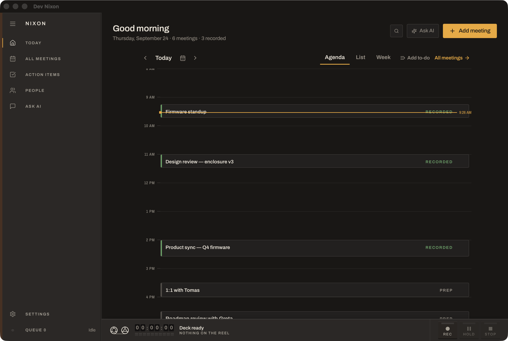
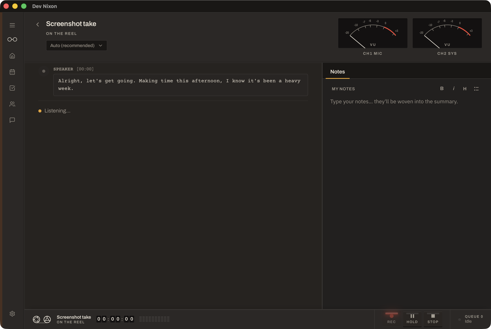
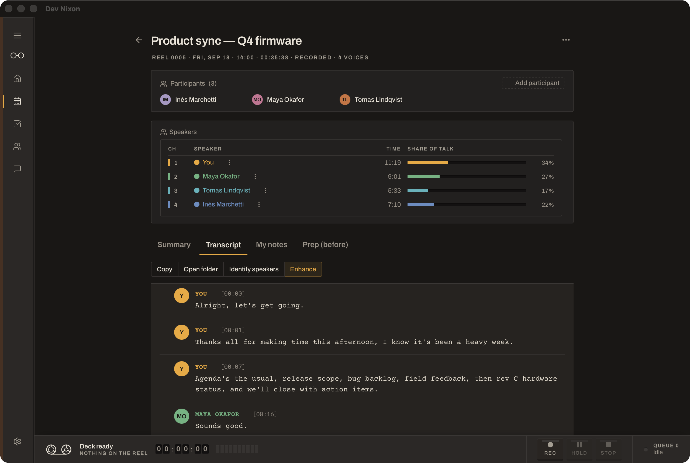
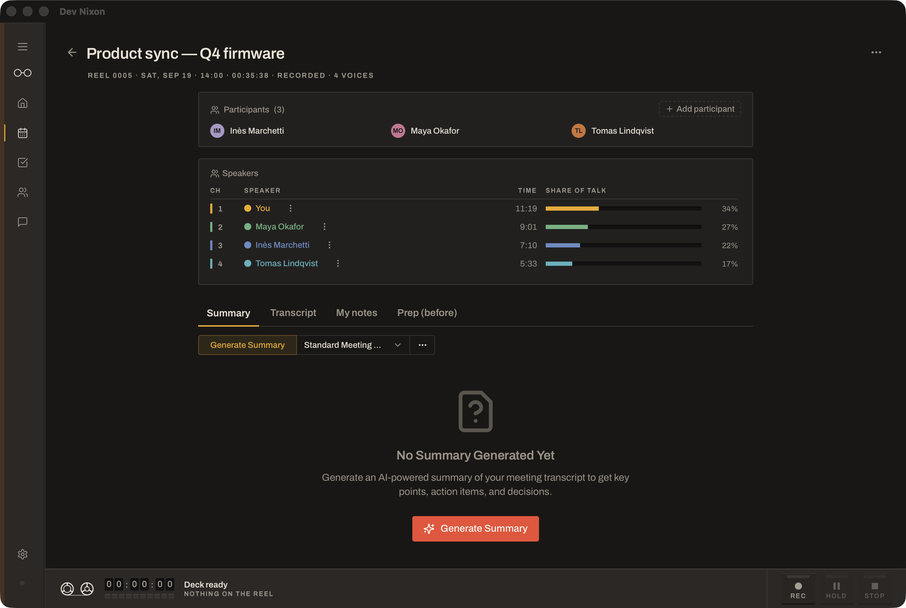
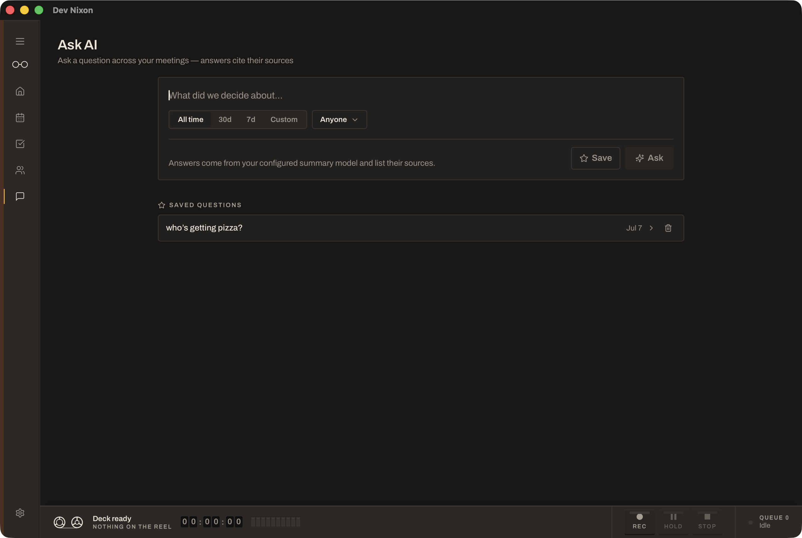
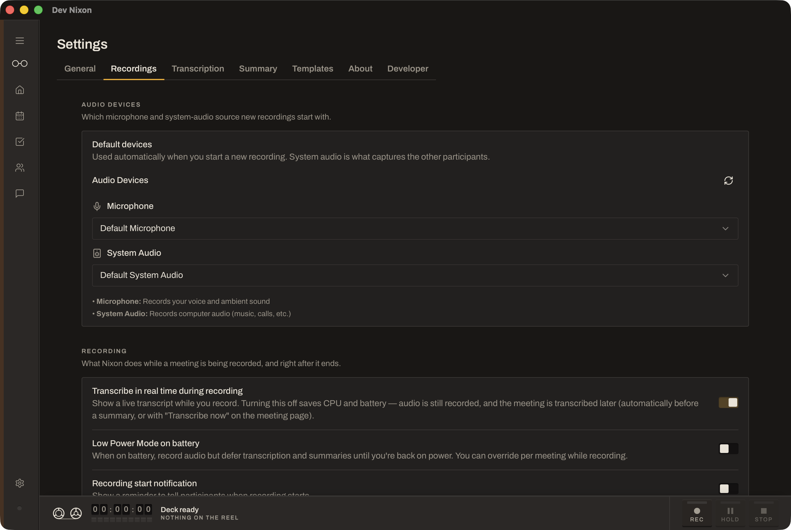

# Nixon

**A meeting assistant that stays on your Mac.**

Nixon sits quietly beside your calls — Zoom, Meet, Teams, or anything else that makes
sound — and writes down what was said, who said it, and what you agreed to. No bot joins
your meeting. No recording is uploaded. Nothing leaves your machine.

### [Download for macOS →](https://github.com/sxates/nixon/releases/latest)

Apple Silicon, macOS 14.4 or later. Open the `.dmg` and drag Nixon to Applications.

---

## What it looks like

| Your day | Recording |
|---|---|
|  |  |

| Who said what | The summary |
|---|---|
|  |  |

| Ask across every meeting | Settings |
|---|---|
|  |  |

Light-theme versions are in [`docs/screenshots/real`](docs/screenshots/real). The meetings
shown are fictional.

---

## What you get

**Your notes, not just a transcript.** Write during the call as you normally would. Nixon
uses what *you* wrote to shape the summary, so it reflects what mattered to you rather
than an even-handed digest of everything anyone said. This is the part most meeting tools
get wrong.

**Who said what.** Speakers are separated automatically, and naming them takes a couple of
clicks — from the calendar invite where there is one. Nixon can also learn voices so it
recognises the same people in later meetings; that is off until you switch it on.

**Walk in prepared.** Before a recurring meeting, Nixon pulls together what happened last
time and which of your action items are still open — so you are not scrolling back through
notes in the thirty seconds before you join.

**One click to join and record.** When a meeting starts, Nixon offers to open the call and
start recording together. Meetings you add yourself work the same way, and if there is no
calendar involved at all you can still put a call on your day by hand.

**Action items that outlive the meeting.** Everything Nixon picks up lands in one list
across all your meetings, assigned and checkable, instead of being stranded in whichever
set of notes you happened to write it in.

**Ask questions across everything you have recorded.** "What did we decide about pricing?"
— answered from your own meetings, with the sources cited so you can check.

**Find it later.** Full-text search across transcripts, notes and summaries, a directory
of the people you meet with, and a browsable history of every recording.

**Bring in audio you already have.** Drop an existing recording onto the window and Nixon
transcribes and summarizes it like anything else.

---

## Private by design

Your meeting audio, transcripts and notes are written to your own disk and are never
uploaded. Transcription and speaker identification run entirely on your Mac.

Summaries do too, by default — on first run Nixon downloads a local model sized to your
machine and uses that. If you would rather use Claude, OpenAI or another provider, you
can, and that is the only case where any part of a meeting leaves your Mac. It is your
choice and it is off unless you make it.

The one other thing Nixon talks to is GitHub, to check whether a new version exists. No
personal data is sent, and you can turn it off in Settings.

Full detail in [`PRIVACY_POLICY.md`](PRIVACY_POLICY.md).

---

## What you need

**Any Apple Silicon Mac running macOS 14.4 or later** — including the original M1. Nixon
sizes its work to your machine rather than demanding a recent one. Intel Macs are not
supported, and 14.4 is the floor because it is where macOS gained the ability to capture
another app's audio without extra software.

You will be asked once for **microphone** and **audio-capture** permission.

**Disk:** about 3 GB for the models Nixon downloads the first time it needs them, plus
roughly 250 MB per hour of recorded audio. Recordings can be set to delete themselves
after a few days in Settings → Recordings.

**Memory:** 8 GB is enough. With 16 GB or more Nixon automatically uses a larger, better
summary model — it checks on first run and chooses for you.

---

## License

MIT — see [`LICENSE.md`](LICENSE.md). Nixon is a fork of
[meetily](https://github.com/Zackriya-Solutions/meeting-minutes) (also MIT) and retains
the original copyright notice. Release history is in [`CHANGELOG.md`](CHANGELOG.md).

With thanks to [Whisper.cpp](https://github.com/ggerganov/whisper.cpp),
[Screenpipe](https://github.com/mediar-ai/screenpipe) and
[transcribe-rs](https://crates.io/crates/transcribe-rs), whose code Nixon borrows; to
[sherpa-onnx](https://github.com/k2-fsa/sherpa-onnx) and the CAM++ embedding model behind
speaker identification; and to **NVIDIA** for the **Parakeet** speech model with
[istupakov](https://huggingface.co/istupakov/parakeet-tdt-0.6b-v3-onnx)'s ONNX conversion.
